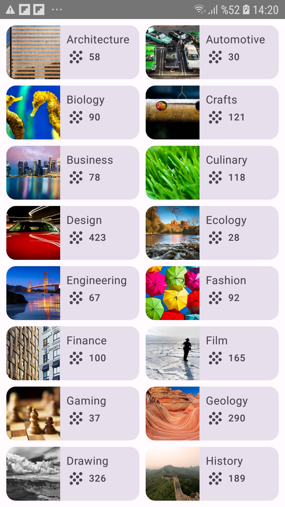

# Courses App 📚

This is a **Courses App** built using **Jetpack Compose**. The app displays a grid of courses, each containing an image, title, and available course count.

## Features ✨
- Uses **Jetpack Compose** for UI.
- Displays courses in a **grid layout**.
- Utilizes **LazyVerticalGrid** for efficient scrolling.
- Includes **icons and images** for better visuals.

## Screenshot 📸


## Technologies Used 🛠️
- **Jetpack Compose**
- **Kotlin**
- **Material 3**
- **LazyVerticalGrid**
- **Composable Functions**

## How to Run 🏃‍♂️
1. Clone this repository:
   ```sh
   git clone https://github.com/tugbaguneyy/Courses.git
   ```
2. Open the project in **Android Studio**.
3. Sync the project with **Gradle**.
4. Run the app on an **emulator or physical device**.


---
🎉 **Happy Coding!** 🚀

